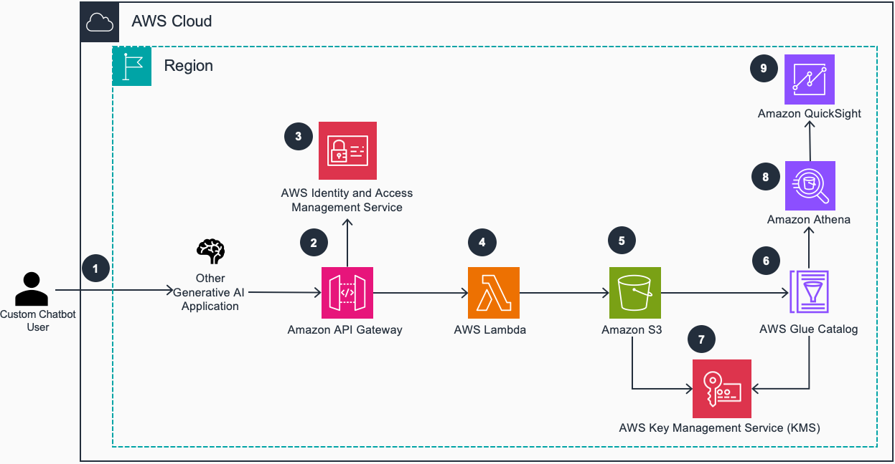
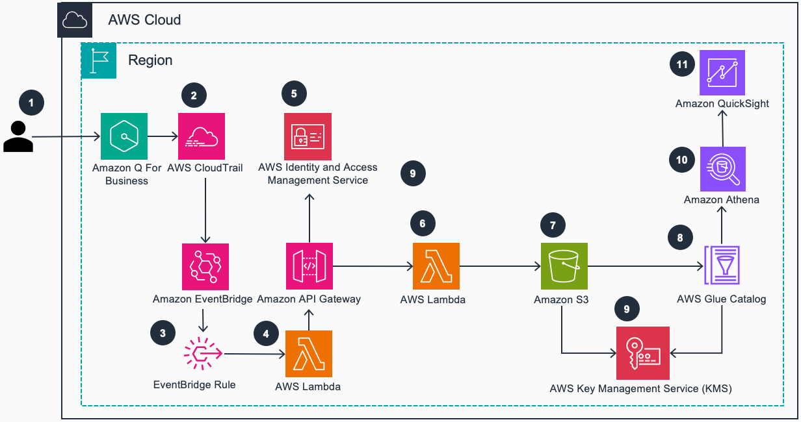

# Guidance for Gen AI Chatbot User Feedback Observability on AWS


## Table of Content

1. [Overview](#overview)
    - [Cost](#cost)
2. [Prerequisites](#prerequisites)
    - [Operating System](#operating-system)
3. [Deployment Steps](#deployment-steps)
4. [Deployment Validation](#deployment-validation)
5. [Running the Guidance](#running-the-guidance)
6. [Next Steps](#next-steps)
7. [Cleanup](#cleanup)

## Overview

This solution guidance offers a prescriptive approach to gathering and storing human feedback from Generative AI applications. It addresses the critical need for businesses to estimate the value of their Generative AI investments by collecting and acting upon user feedback. The solution enables decision-makers to easily access and visualize Key Performance Indicators (KPIs) derived from user satisfaction data. It implements a feedback collection mechanism for custom-built chatbots on AWS, as well as for [Amazon Q](https://docs.aws.amazon.com/amazonq/) for Business chatbots. By collecting user ratings and comments on chat responses, businesses can gain valuable insights into the performance and effectiveness of their Generative AI applications.

The solution exposes a rest api endpoint /feedback which can be invoked by the chatbot application to store feedback for analysis. The feedback endpoint expects a json payload with the following attributes:
- ```userId``` (mandatory): username/id of the user who is submitting the feedback
- ```appIdentifier``` (mandatory): unique identifier for the chatbot application
- ```prompt``` (mandatory): prompt/query posted by the user
- ```response``` (mandatory): response generated by the chatbot
- ```feedback``` (mandatory): feedback (thumbsup, thumbsdown, useful, not_useful etc)
- ```comment``` (optional): additional comment provided by the user
- ```sourceAttribution``` (optional): source provided by the chatbot
- ```source_attribution_urls``` (optional): URL's of the sources.
- ```submittedAt``` (optional): time the feedback was submitted at
- ```interactionId``` (optional): Unique Identifier for the current interaction/query/promt. If no identifer is provided a uuid would be generated to uniquely identify each submission
Events ingested from the API are cleanse, mapped to a common data model and stored into a data lake. Users can then query the feedback data using [Amazon Athena](https://docs.aws.amazon.com/athena/). Optionally [Amazon QuickSight](https://docs.aws.amazon.com/quicksight/) can be used to analyze the collected feedback.

### Generic Chatbot Feedback Observability



1. User shares feedback on their last interaction with a Gen AI chatbot application (based [Amazon Bedrock](https://docs.aws.amazon.com/bedrock/) or [Amazon Sagemaker](https://docs.aws.amazon.com/sagemaker/) hosted models).
2. The feedback is posted using the Feedback API Generic endpoint deployed in [Amazon API Gateway](https://docs.aws.amazon.com/apigateway/).
3. By default, access to the API is protected by [AWS Identity and Access Management (IAM)](https://docs.aws.amazon.com/iam/) making it available only to IAM authenticated principals
4. The Lambda function processes feedback events by cleansing and mapping the data to the feedback data model. It also handles  the feedback data storage into Amazon S3. 
5. Feedback metadata and quality metrics are then stored into [Amazon S3](https://docs.aws.amazon.com/s3/).
6. The feedback metrics metadata are catalogued and maintained within an [AWS Glue](https://docs.aws.amazon.com/glue/) Catalog table.
7. Both the metrics data and metadata are stored encrypted using [AWS Key Management Service (KMS)](https://docs.aws.amazon.com/kms/).
8. Amazon Athena allows to run SQL queries against the feedback table
9. Amazon QuickSight allows to build visuals and dashboards providing insight into the Feedback metrics.

### Amazon Q Chatbot Feedback Observability



1. User shares feedback on their last interaction with an Amazon Q Chatbot application
2. The feedback events are captured in [Amazon CloudTrail](https://docs.aws.amazon.com/cloudtrail/).
3. An Amazon EventBridge rule triggers an AWS Lambda function to process Q originated events
4. AWS Lambda pushes the feedback received from Amazon Q through the Feedback API endpoint
5. By default, access to the API is protected by AWS Identity and Access Management (IAM) making it available only to IAM authenticated principals
6. The Lambda function processes feedback events by cleansing and mapping the data to the feedback data model. It also handles  the feedback data storage into Amazon S3. 
7. Feedback metadata and quality metrics are then stored into Amazon S3.
8. The feedback metrics metadata are catalogued and maintained within an AWS Catalog table.
9. Both the metrics data and metadata are stored encrypted using AWS Key Management Service (KMS).
10. Amazon Athena allows to run SQL queries against the feedback table
11. Amazon QuickSight allows to build visuals and dashboards providing insight into the Feedback metrics.

### Cost

You are responsible for the cost of the AWS services used while running this Guidance. As of April 2024, the cost for running this Guidance with the default settings in the us-east-1 is approximately $78.92 per month for processing


We recommend creating a [Budget](https://docs.aws.amazon.com/cost-management/latest/userguide/budgets-managing-costs.html) through [AWS Cost Explorer](https://aws.amazon.com/aws-cost-management/aws-cost-explorer/) to help manage costs. Prices are subject to change. For full details, refer to the pricing webpage for each AWS service used in this Guidance.

### Sample Cost Table

The following table provides a sample cost breakdown for deploying this Guidance with the default parameters in the US East (N. Virginia) Region for one month.

| AWS service  | Dimensions | Cost [USD] |
| ----------- | ------------ | ------------ |
| Amazon API Gateway | 100,000 REST API calls per month  | $ 0.35/month |
| AWS Lambda | 100,000 requests per month. 256 MB allocated memory, 512 ephemerel storage | $ 0.00 |
| AWS Glue | 1 Crawler with average duration of 3 minutes  | $ 0.07/month |
| Amazon Athena | 10,000 queries 1 GB data scanned per quert  | $ 48.83/month |
| Amazon S3 | 5 GB standard tier data, 100,000 PUT request and 10,000 select requests  | $ 0.62/month |
| Amazon Quicksight | 1 Active reader and 1 active author  | $ 29.00/month |


## Prerequisites

The project code uses the Python version of the AWS CDK ([Cloud Development Kit](https://aws.amazon.com/cdk/)). To execute the project code, please ensure that you have fulfilled the [AWS CDK Prerequisites for Python](https://docs.aws.amazon.com/cdk/latest/guide/work-with-cdk-python.html).

The project code requires that the AWS account is [bootstrapped](https://docs.aws.amazon.com/de_de/cdk/latest/guide/bootstrapping.html) to allow the deployment of the CDK stack. 

For building the lambda layer docker needs to be installed and running. 

### Operating System
These deployment instructions are optimized to best work on a Mac or Linux environment. Deployment in Windows may require additional steps for setting up required libraries and CLI. 


### AWS account requirements

This deployment requires you have an Amazon Q Business application deployed in your account.


### aws cdk bootstrap 

This Guidance uses aws-cdk. If you are using aws-cdk for first time, please perform the below bootstrapping....
``` cdk boostrap```


### Supported Regions

Amazon Q Buiness is currently generally available. Please refer to the public documentation for the list of available AWS regions.


## Deployment Steps

This project is set up like a standard Python project. The initialization process also creates a virtualenv within this project, stored under the .venv directory.  To create the virtualenv it assumes that there is a `python3` executable in your path with access to the `venv` package. If for any reason the automatic creation of the virtualenv fails, you can create the virtualenv
manually once the init process completes.

**BEFORE DEPLOYING**
The sample solution requires deploying Amazon 
1. [Steps for deploying your Amazon Q web experience](https://docs.aws.amazon.com/amazonq/latest/business-use-dg/deploy-instructions.html)

2. Once you have deployed Amazon Q application copy the application ID.

    
    

### Deploy solution
1. Clone the repo using the command ```git clone xxxxxxx```
2. Navigate to deployment directory ```cd guidance-for-ai-chatbot-user-feedback-analytics/deployment/```

3. install and activate a Python Virtual Environment

    ```python3 -m venv .venv```

    ```source .venv/bin/activate```

4. Install dependant libraries
```python -m pip install -r ai-chatbot-feedback-analytics/requirements.txt```

5. Update the CDK Context Parameters
```
    "classification": "confidential"
    "application_id": "xxxxx-xxxxx-xxxx-xxxx-xxxxx
```
    1. classification: data classification tag for the s3 bucket default confidential

    2. application_id - Amazon Q for Business applicationid.  For example: xxxxx-xxxxx-xxxx-xxxx-xxxxx
6. Run this command to deploy the stack ```cdk deploy```


## Deployment Validation

* On successful deployment cdk deployment you should be able to view the stack's output from the Amazon CloudFormation console.
1. On the CloudFormation console select ```ai-chatbot-feedback-analytics-stack```
2. Select the Outputs tab. Confirm that the following output keys are available and populated
- APIGatewayURL
- feedbackdatabucketname
- llmappfeedbackapiEndpointXXXXXX

## Running the Guidance


## Next Steps

The guidance shows a mechanism to collect user feedback. One possible area of application could be collecting feedback while testing out different prompts with the chatbots. 

The collected data can be analyzed using Amazon QuickSight and each of the feedback may require different mechanism to improve LLM response for e.g.
- Adding additional data 
- Prompt engineering
- [Relevance tuning](https://docs.aws.amazon.com/amazonq/latest/qbusiness-ug/metadata-boosting.html)
- Retrivel evaluation

## Limitations and security considerations

### Amazon Q for Business feedback details
The Amazon Q for Business version of the guidance only collects unique identifiers of Q interactions and messages. The actual content can be retrieved using the qbusiness:ListMessages API. Please note that the QBusiness API operations now require an authenticated identity through IAM Identity Center. The implementation depends on the Identity Provider integrated with IAM IdC. Please refer to [Custom Web Experience with Amazon Q Business](https://github.com/aws-samples/custom-web-experience-with-amazon-q-business) for a sample implementation using Amazon Cognito as IdP.

### Working with sensitive information (e.g. PII)
This guidance provides Amazon Cloudformation templates that configure encryption at rest with AWS KMS SSE for Amazon S3 and AWS Glue, and Amazon Athena. Data is also encrypted in transit by default.
To keep cost low the guidance does not include any built-in PII detection or redaction features. However there are a few options you may consider, should you need to extend the solution to implement a sensitive data management strategy:
- [Amazon Macie](https://aws.amazon.com/macie/)
- [Amazon Comprehend](https://aws.amazon.com/comprehend/)

## Cleanup

1. Navigate to deployment directory ```cd guidance-for-ai-chatbot-user-feedback-analytics/deployment/```
2. Run this command to cleanup ```cdk destroy```

